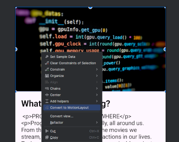
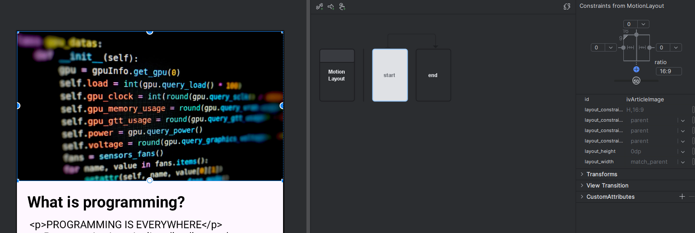
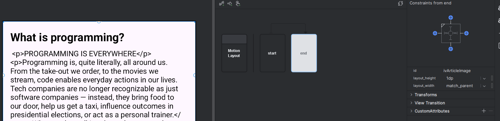
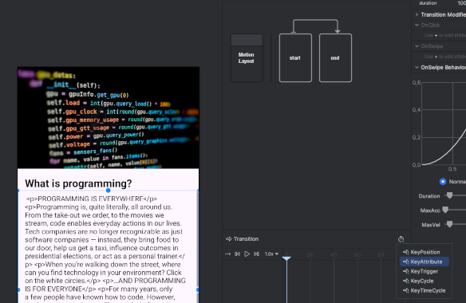
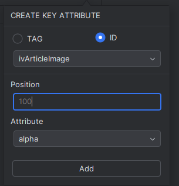
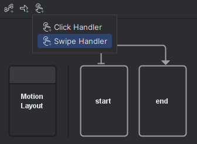
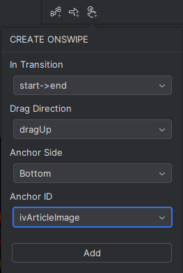
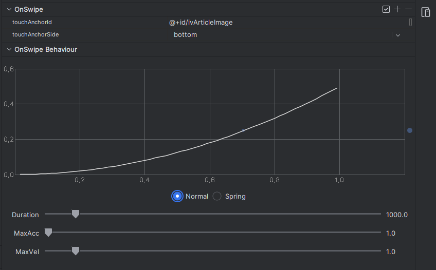

# MotionLayout 🌊

## Zakaj MotionLayout? 🤔
MotionLayout je razširitev in podporna knjižnica za **ConstraintLayout**, ki omogoča izvajanje in koordinacijo animacij večih pogledov. 
Namenjena je premikanju, spreminjanju velikosti in animaciji gradnikov UI-ja s katerimi uporabnik komunicira. Ker je MotionLayout podporna knjižnica za ConstraintLayout 2.0, je minimalna verzija android API-ja **14 (Android 4.0)**.
Ponuja deklarativen način definiranja animacij v XML, kar olajša vizualizacijo in upravljanje animacij v primerjavi s tradicionalnimi imperativnimi pristopi.

---

## Prednosti 👍
- **Enostavnost uporabe**: MotionLayout omogoča ustvarjanje animacij z uporabo deklarativnega pristopa na osnovi XML, neglede na kompleksnost animacije.
- **Integracija**: Je del knjižnice ConstraintLayout, ki je široko uporabljena in dobro integrirana v ekosistem Android.
- **Večstopenjski prehodi**: Omogoča definiranje animacij z več stopnjami ali stanji, kar omogoča ustvarjanje kompleksnejšega uporabniškega vmesnika
- **Fleksibilnost**: Podpira širok spekter animacij in prehodov, vključno s ključnimi sličicami, lajšanjem in prilagojenimi atributi.
- **Orodja**: Android Studio ima vgrajen Motion Editor za vizualno oblikovanje in predogled animacij.

---

## Slabosti 👎
- **Učna krivulja**: Zahteva razumevanje konceptov ConstraintLayout in MotionLayout.
- **Kompleksnost preprostih animacij**: Pri preprostih animacijah zna biti MotionLayout overkill, saj bi isto lahko dosegli z bolj preprostimi orodji za animacijo
- **Zmogljivost**: Kompleksne animacije lahko vplivajo na zmogljivost, če niso pravilno optimizirane.
- **Dokumentacija**: Čeprav se izboljšuje, dokumentacija in podpora skupnosti nista tako obsežni kot pri nekaterih drugih knjižnicah.

---

## Licenca 📜
MotionLayout je del knjižnice ConstraintLayout, ki je licencirana pod [*Apache License 2.0*](https://github.com/androidx/constraintlayout/blob/main/LICENSE).
- **Prosta uporaba**: Uporaba za osebne, komercialne ali izobraževalne namene
- **Odprto-kodnost**: Kodo lahko spreminjaš oz prilagajaš brez omejitev

---

## Statistika uporabe

### Število uporabnikov
Široko uporabljena v skupnosti razvijalcev za Android, dosti tutorialov za uporabo na voljo na spletu.

### Vzdrževanje
Aktivno vzdrževana s strani ekipe za Android pri Googlu. Redne posodobitve in izboljšave knjižnice. Zadnja posodobitev: 6 dni nazaj (9.1.2025).


---

## Primer uporabe

### Dodajanje odvisnosti
Dodajte naslednjo odvisnost v vašo datoteko `build.gradle`:

```gradle
dependencies {
    implementation(libs.androidx.constraintlayout)
}
```

Ko imamo željen constraint layout, v grafičnem urejevalniku kliknemo **convert to MotionLayout**.



To nam nekoliko preoblikuje XML datoteko in sicer spremeni ConstraintLayout v MotionLayout ter doda atribut **layoutDescription**.

```XML
<androidx.constraintlayout.motion.widget.MotionLayout xmlns:android="http://schemas.android.com/apk/res/android"
    xmlns:app="http://schemas.android.com/apk/res-auto"
    xmlns:tools="http://schemas.android.com/tools"
    android:id="@+id/main"
    android:layout_width="match_parent"
    android:layout_height="match_parent" 
    app:layoutDescription="@xml/activity_main_scene"
    tools:context=".MainActivity">

        ...
    
</androidx.constraintlayout.motion.widget.MotionLayout>
```
**layoutDescription** poveže novo generirano XML datoteko **activity_main_scene** v kateri so opisane tranzicije oz. animacije.

```XML
<MotionScene 
    xmlns:android="http://schemas.android.com/apk/res/android"
    xmlns:motion="http://schemas.android.com/apk/res-auto">

    <Transition
        motion:constraintSetEnd="@+id/end"
        motion:constraintSetStart="@id/start"
        motion:duration="1000">
       <KeyFrameSet>
       </KeyFrameSet>
    </Transition>

    <ConstraintSet android:id="@+id/start">
    </ConstraintSet>

    <ConstraintSet android:id="@+id/end">
    </ConstraintSet>
</MotionScene>
```

Animacije lahko urejamo kar v tej datoteki ampak raje uporabimo **Motion Editor**, ki je orodje za lažje delo z MotionLayout-om.
V urejevalniku imamo **start** in **end** točki, ki predstavljata stanje našega layout-a pred in po tranziciji, ter puščico ki predstavlja tranzicijo. 

V točki start pustimo layout enak kot je privzeto.



V točki end pa odstranimo omejitve slike, ter ji velikost nastavimo na 1dp.


Sedaj pa moremo konfigurirati kako bomo iz začetnega stanja prišli v končno. To storimo tako, da kliknemo na puščico, ki stanji povezuje. Spodaj lahko vidimo transition timeline, ki predsavlja potek animacije skozi čas.



Tranziciji dodamo nov attribut tipa **KeyAttribute**. Izbrati moramo komponento nad katero attribut deluje in pozicijo na časovnici tranzicije. Na koncu izberemo še atribut ki ga želimo spremeniti (alpha, scaleX, scaleY...).




Ko smo definirali začetno in končno stanje tranzicije, ter njen potek moramo še določiti, kdaj naj se tranzicija sproži. To storimo z dodajanjem **click** oz **swipe handler**-ja. Izberemo **smer potega**, **od kod moramo potegniti** in **id komponente**.




Ustvarjen swipe handler lahko tudi konfiguriramo na desni strani urejevalnika.



Na koncu XML datoteka **activity_main_scene** izgleda tako:

```XML
<MotionScene 
    xmlns:android="http://schemas.android.com/apk/res/android"
    xmlns:motion="http://schemas.android.com/apk/res-auto">

    <Transition
        motion:constraintSetEnd="@+id/end"
        motion:constraintSetStart="@id/start"
        motion:duration="1000">
       <KeyFrameSet>
           <KeyAttribute
               motion:motionTarget="@+id/ivArticleImage"
               motion:framePosition="100"
               android:alpha="0" />
           <KeyAttribute
               motion:motionTarget="@+id/ivArticleImage"
               motion:framePosition="50"
               android:alpha="0" />
           <KeyAttribute
               motion:motionTarget="@+id/ivArticleImage"
               motion:framePosition="100"
               android:scaleX="0" />
           <KeyAttribute
               motion:motionTarget="@+id/ivArticleImage"
               motion:framePosition="100"
               android:scaleY="0" />
       </KeyFrameSet>
        <OnSwipe
            motion:touchAnchorId="@+id/ivArticleImage"
            motion:touchAnchorSide="bottom" />
    </Transition>

    <ConstraintSet android:id="@+id/start">
    </ConstraintSet>

    <ConstraintSet android:id="@+id/end">
        <Constraint
            android:layout_height="1dp"
            android:layout_width="match_parent"
            android:id="@+id/ivArticleImage" />
    </ConstraintSet>
</MotionScene>
```

### Rezultat:


---

## Uporaba v aplikaciji (projektna naloga):

```XML
<!--TODO-->
```